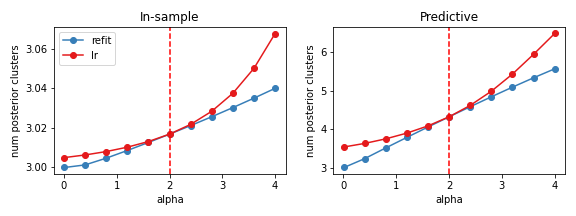

# BNP sensitivity

This repo contains code to reproduce the experiments found in our manuscript

Ryan Giordano, Runjing Liu, Michael I. Jordan, Tamara Broderick.
"Evaluating sensitivity to the Stick Breaking Prior in Bayesian Nonparametrics."
[https://arxiv.org/abs/2107.03584](https://arxiv.org/abs/2107.03584)

We evaluated local sensitivity on three data analysis problems:

1. a Gaussian mixture model of the canonical iris data set;
2. a regression model of time-course gene expression data;
3. and a topic model inferring population structure from genetic data.

## Installation

To install the package used for all the models we consider:
```
pip install BNP_modeling
```

Dependencies include [jax](https://jax.readthedocs.io/en/latest/index.html) and the [jax branch of paragami](https://github.com/rgiordan/paragami/tree/jax).
These will be installed automatically with the command above.

Our iris experiments, mice experiments, and population genetics experiments are contained in the `./GMM_clustering/`, `GMM_regression_clustering`, and `./structure/` folders, respectively. To install libraries specific to those experiments, run

```
pip install GMM_clustering
pip install GMM_regression_cluster
pip install structure
```
respectively.

## Results

The results presented in our main paper are produced entirely within Jupyter notebooks.
In each expreriment folder (`./GMM_clustering/`, `GMM_regression_clustering` and `./structure/`),
the `jupyter` subfolder contains notebooks to reproduce our results.

For example, the [./GMM_clustering/jupyter/parametric_sensitivity.ipynb](https://github.com/Runjing-Liu120/BNP_sensitivity/blob/master/GMM_clustering/jupyter/parametric_sensitivity.ipynb)
file reproduces the parametric sensitivity results for our GMM/iris epxeriment (Figure 2 in the paper).

<figure>

    <figcaption>
        The expectd number of in-sample clusters (left) and the expected number of predictive cluster (right) 
        as a function of the GEM concentration parameter. In red is the linear approximation, while in blue 
        are results from re-fitting the variational approxmation. 
    </figcaption>
</figure>
